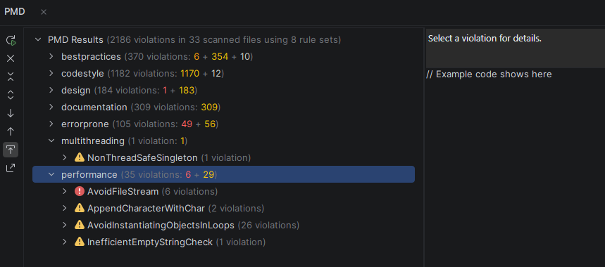
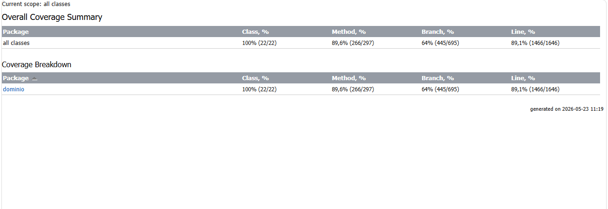

# 🎮 The DOPO Hardest Game

**Universidad Escuela Colombiana de Ingeniería**  
**Programación Orientada por Objetos — 2026-1**

**Autores:** Diego Alejandro Mesa · Andrés Felipe Rubio

---

## 📋 Descripción del Proyecto

The DOPO Hardest Game es una versión mejorada del clásico *The World's Hardest Game*. El jugador controla un cuadrado rojo que debe recolectar todas las monedas del nivel y llegar a la zona verde final, mientras esquiva enemigos en constante movimiento. El proyecto aplica todos los conceptos de Programación Orientada por Objetos vistos durante el semestre.

---

## ✨ Características implementadas

| Característica | Descripción |
|----------------|-------------|
| **3 Modalidades** | Player (1 jugador), PvP (2 jugadores), PvM (vs IA) |
| **3 Skins de jugador** | Rojo (estándar), Azul (rápido + grande), Verde (resistente con escudo) |
| **4 Tipos de enemigos** | Básico, Rápido, Patrullero (circular/cuadrado/ocho), Perseguidor (IA) |
| **2 Perfiles de IA** | Aleatoria (movimientos al azar), Experta (BFS pathfinding) |
| **Elementos especiales** | Bombas (destruyen jugadores/enemigos), Fuentes de vida (vidas extra) |
| **Zonas seguras** | Inicio, Intermedia (checkpoint), Final |
| **Persistencia** | Guardar/Cargar partida (.save), Configuraciones desde .txt |
| **Sistema de logs** | Registro de errores y eventos del juego |

---

## 🚀 Guía para ejecutar el juego

### Requisitos previos
- Java 11 o superior instalado
- IntelliJ IDEA (recomendado)

### Pasos para ejecutar

**1. Clonar el repositorio:**
```bash
git clone https://github.com/Andres14-Rubio/TheDopoHardestGame.git
```

**2. Abrir en IntelliJ IDEA:**
- Abrir IntelliJ → `File` → `Open` → seleccionar la carpeta del proyecto

**3. Agregar librerías:**
- Clic derecho en el proyecto → `Open Module Settings`
- En `Libraries` → `+` → agregar todos los `.jar` de la carpeta `lib/`

**4. Ejecutar el juego:**
- Abrir el archivo `src/presentacion/VentanaPrincipal.java`
- Clic derecho → `Run 'VentanaPrincipal.main()'`
- O presionar `Shift + F10`

### Controles

| Acción | Jugador 1 | Jugador 2 (PvP) |
|--------|-----------|-----------------|
| Mover arriba | `W` | `↑` |
| Mover abajo | `S` | `↓` |
| Mover izquierda | `A` | `←` |
| Mover derecha | `D` | `→` |

---

## 🗂️ Estructura del Proyecto

```
src/
├── dominio/
│   ├── Entidad.java            # Clase base abstracta
│   ├── Jugador.java
│   ├── Enemigo.java            # Clase abstracta
│   ├── EnemigoBasico.java
│   ├── EnemigoRapido.java
│   ├── EnemigoPatrullero.java
│   ├── EnemigoPerseguidor.java
│   ├── Moneda.java
│   ├── MonedaSkin.java
│   ├── Zona.java
│   ├── Bomba.java
│   ├── FuenteVida.java
│   ├── ElementoEspecial.java
│   ├── Nivel.java
│   ├── Juego.java
│   ├── EstadoPartida.java
│   ├── Configuracion.java
│   ├── ErrorLogger.java        # Singleton
│   ├── JuegoException.java
│   ├── Movible.java            # Interfaz
│   ├── PerfilMaquina.java      # Interfaz
│   ├── MaquinaAleatoria.java
│   └── MaquinaExperta.java     
├── presentacion/
│   ├── VentanaPrincipal.java   # Clase principal - punto de entrada
│   ├── PanelJuego.java
│   ├── PanelInformacion.java
│   ├── PanelBotones.java
│   ├── DialogoConfiguracion.java
│   ├── DialogoFinJuego.java
│   ├── ControladorTeclado.java
│   ├── Renderizador.java
│   └── TemporizadorJuego.java
└── test/
    └── dominioTest.java
```

---

## 🗺️ Diagrama de Clases

```
                    ┌─────────────┐
                    │   Entidad   │  (abstracta)
                    │─────────────│
                    │ x, y, ancho │
                    │ alto, color │
                    └──────┬──────┘
                           │ hereda
         ┌─────────────────┼──────────────────┐
         │                 │                  │
    ┌────┴────┐      ┌──────┴──────┐    ┌─────┴──────────┐
    │Jugador  │      │   Moneda    │    │ElementoEspecial│ (abstracta)
    └─────────┘      │─────────────│    └────────┬───────┘
                     │ MonedaSkin  │             │
                     └─────────────┘     ┌───────┴───────┐
                                         │               │
                                      ┌──┴──┐       ┌────┴──────┐
                                      │Bomba│       │FuenteVida │
                                      └─────┘       └───────────┘

                    ┌─────────────┐
                    │   Enemigo   │  (abstracta)
                    │─────────────│
                    │ velocidad   │
                    │ mover()     │
                    └──────┬──────┘
                           │ hereda
    ┌──────────────┬────────┴──────────┬─────────────────┐
    │              │                   │                  │
┌───┴──────┐ ┌─────┴──────┐ ┌──────────┴───┐ ┌───────────┴────┐
│Enemigo   │ │Enemigo     │ │Enemigo       │ │Enemigo         │
│Basico    │ │Rapido      │ │Patrullero    │ │Perseguidor     │
└──────────┘ └────────────┘ └──────────────┘ └────────────────┘

    ┌──────────────┐         ┌─────────────────┐
    │  «interface» │         │   «interface»   │
    │   Movible    │         │  PerfilMaquina  │
    │──────────────│         │─────────────────│
    │  mover()     │         │  decidirMov()   │
    └──────┬───────┘         └────────┬────────┘
           │ implementa               │ implementa
      (Enemigos)            ┌─────────┴──────────┐
                            │                    │
                   ┌────────┴──────┐    ┌─────────┴──────┐
                   │MaquinaAleat.. │    │MaquinaExperta  │
                   │               │    │ (BFS)          │
                   └───────────────┘    └────────────────┘

    ┌─────────────┐     ┌──────────────┐     ┌───────────────┐
    │    Juego    │────▶│    Nivel     │────▶│Configuracion  │
    └─────────────┘     └──────────────┘     └───────────────┘
           │
    ┌──────┴──────┐
    │ErrorLogger  │  (Singleton)
    └─────────────┘
```

---

## 🧠 Temas de POO implementados

| Tema | Implementación |
|------|----------------|
| **Herencia** | `Enemigo` → `EnemigoBasico`, `EnemigoRapido`, `EnemigoPatrullero`, `EnemigoPerseguidor`<br>`Entidad` → `Jugador`, `Moneda`, `Zona`, `ElementoEspecial` |
| **Polimorfismo** | Método `mover()` en cada enemigo, `dibujar()` en elementos especiales |
| **Encapsulamiento** | Atributos `private` con getters/setters en todas las clases |
| **Interfaces** | `Movible` (para entidades que se mueven), `PerfilMaquina` (para IAs) |
| **Clases abstractas** | `Enemigo`, `Entidad`, `ElementoEspecial` |
| **Singleton** | `ErrorLogger` (única instancia global) |
| **Manejo de excepciones** | `JuegoException` personalizada |
| **Colecciones** | `ArrayList<>`, `List<>`, `Iterator` para monedas, enemigos, bombas |
| **Archivos** | `BufferedReader`, `PrintWriter`, `FileReader` para configuración y guardado |
| **Patrón BFS** | `MaquinaExperta` usa búsqueda en anchura para encontrar camino óptimo |

---

## 🎨 Patrones de Diseño

### 1. Singleton — `ErrorLogger`
El `ErrorLogger` garantiza que exista una única instancia del sistema de logging en toda la aplicación. Esto evita que múltiples instancias escriban simultáneamente en el archivo de log, previniendo corrupción de datos.

```java
// Una sola instancia global
ErrorLogger logger = ErrorLogger.getInstance();
logger.log("Evento del juego");
```

### 2. Strategy — `PerfilMaquina`
La interfaz `PerfilMaquina` permite intercambiar el comportamiento de la IA en tiempo de ejecución sin modificar el código del jugador máquina. `MaquinaAleatoria` y `MaquinaExperta` son dos estrategias diferentes que implementan la misma interfaz.

```java
PerfilMaquina ia = new MaquinaExperta();  // o new MaquinaAleatoria()
ia.decidirMovimiento(estadoActual);
```

### 3. Template Method — `Enemigo` (abstracta)
La clase abstracta `Enemigo` define el esqueleto del comportamiento de todos los enemigos. Cada subclase (`EnemigoBasico`, `EnemigoRapido`, `EnemigoPatrullero`, `EnemigoPerseguidor`) implementa su propio método `mover()`, personalizando el comportamiento sin cambiar la estructura general.

---

## 📚 Temas y Lecciones Aprendidas

### Lo que aprendimos aplicando POO en un proyecto real

**Herencia y jerarquías de clases:** Diseñar la jerarquía `Entidad → Enemigo → EnemigoBasico` nos enseñó que una buena jerarquía de clases reduce drásticamente la duplicación de código. Al principio teníamos lógica repetida en cada tipo de enemigo; al abstraerla en `Enemigo`, el código se volvió mucho más mantenible.

**Interfaces vs clases abstractas:** Aprendimos en la práctica cuándo usar una interfaz (`Movible`, `PerfilMaquina`) y cuándo una clase abstracta (`Enemigo`, `Entidad`). Las interfaces definen contratos de comportamiento; las clases abstractas comparten implementación común.

**El patrón Singleton:** Implementar `ErrorLogger` como Singleton nos mostró los beneficios de controlar el número de instancias de una clase, especialmente cuando hay recursos compartidos como archivos de log.

**Manejo de archivos y persistencia:** Implementar el sistema de guardado/carga de partidas con `BufferedReader` y `PrintWriter` fue uno de los retos más interesantes. Aprendimos a serializar el estado complejo de un juego en un formato de texto legible.

**Algoritmos en POO — BFS:** Integrar el algoritmo de búsqueda en anchura dentro de `MaquinaExperta` nos mostró cómo los algoritmos clásicos se integran naturalmente en el diseño orientado por objetos.

**Pruebas unitarias:** Escribir 80 métodos de prueba para `dominioTest.java` nos enseñó que testear es tan importante como programar. Encontramos varios bugs durante las pruebas que no habíamos detectado manualmente.

---

## 🔄 Retrospectiva del Proyecto

### ¿Qué salió bien?
- La jerarquía de clases quedó limpia y extensible; agregar un nuevo tipo de enemigo requiere solo crear una nueva subclase.
- El sistema de configuración desde archivos `.txt` hace el juego muy flexible sin recompilar.
- La cobertura de pruebas del 89% en líneas demuestra un esfuerzo real de verificación.
- El algoritmo BFS en `MaquinaExperta` funciona correctamente y hace la IA desafiante.

### ¿Qué mejoraríamos con más tiempo?
- **Javadocs completos:** Documentar todos los métodos públicos con el formato estándar para reducir las 309 violaciones de PMD en documentación.
- **Refactorizar `codestyle`:** Aplicar el formateador automático de IntelliJ para eliminar las 1182 violaciones de estilo de una sola vez.
- **Thread-safe Singleton:** Hacer `ErrorLogger` thread-safe con `synchronized` para mayor robustez.
- **Object pooling:** Evitar crear objetos dentro de los bucles del motor para mejorar el rendimiento (`AvoidInstantiatingObjectsInLoops`).
- **Más niveles:** El sistema de carga desde `.txt` facilita agregar niveles nuevos sin tocar el código.

### Distribución del trabajo
- **Diego Alejandro Mesa:** Lógica de dominio, algoritmos de movimiento, sistema de niveles, BFS.
- **Andrés Felipe Rubio:** Interfaz gráfica (Swing), sistema de persistencia, pruebas unitarias, configuración.

---

## 🔍 Informe PMD

### ¿Qué es PMD?
PMD es una herramienta de análisis de código estático para Java que examina el código fuente sin ejecutarlo, detectando problemas potenciales antes de que ocurran en producción.

### Resultado: 2186 violaciones en 33 archivos · 8 rule sets



| Categoría | Violaciones | Detalle |
|-----------|-------------|---------|
| **bestpractices** | 370 | 6 errores · 354 advertencias · 10 info |
| **codestyle** | 1182 | 1170 errores · 12 advertencias |
| **design** | 184 | 1 error · 183 advertencias |
| **documentation** | 309 | 309 advertencias |
| **errorprone** | 105 | 49 errores · 56 advertencias |
| **multithreading** | 1 | `NonThreadSafeSingleton` |
| **performance** | 35 | `AvoidFileStream`(6), `AppendCharacterWithChar`(2), `AvoidInstantiatingObjectsInLoops`(26), `InefficientEmptyStringCheck`(1) |
| **Total** | **2186** | en 33 archivos escaneados |

### Análisis por categoría

- **`codestyle` (1182):** Convenciones de nombres y formato. No afectan la funcionalidad. Corregibles con el formateador automático de IntelliJ.
- **`documentation` (309):** Faltan Javadocs formales. Las clases tienen comentarios internos pero no en formato `/** */`.
- **`AvoidInstantiatingObjectsInLoops` (26):** Objetos creados en el bucle del motor de juego. Inherente a la arquitectura de un juego en tiempo real.
- **`AvoidFileStream` (6):** Uso de `FileInputStream`; mejorable con Java NIO en versiones futuras.
- **`NonThreadSafeSingleton` (1):** `ErrorLogger` no es thread-safe; aceptable en un juego de un solo hilo.

**Conclusión:** El 54% de violaciones son de estilo puro, el 14% de documentación formal. No se detectó ningún bug crítico ni vulnerabilidad.

---

## 📊 Informe de Cobertura de Pruebas

### Resumen general



| Métrica | Cubierto | Total | Porcentaje |
|---------|----------|-------|------------|
| **Clases** | 22 | 22 | **100%** ✅ |
| **Métodos** | 266 | 297 | **89,6%** ✅ |
| **Ramas** | 445 | 695 | **64%** ⚠️ |
| **Líneas** | 1466 | 1646 | **89,1%** ✅ |

### ¿Por qué el 64% en ramas?
La cobertura de ramas es la más difícil en un motor de juego. El 36% no cubierto corresponde a: lógica de colisiones que depende de posiciones exactas en pantalla, estados del algoritmo BFS que requieren configuraciones específicas de nivel, y bloques `catch` de errores de I/O difíciles de forzar en pruebas normales.

**Conclusión:** 100% de clases cubiertas y 89% de líneas es excelente para un motor de juego. Una cobertura de ramas superior al 60% se considera muy buena en aplicaciones con lógica de juego en tiempo real.
